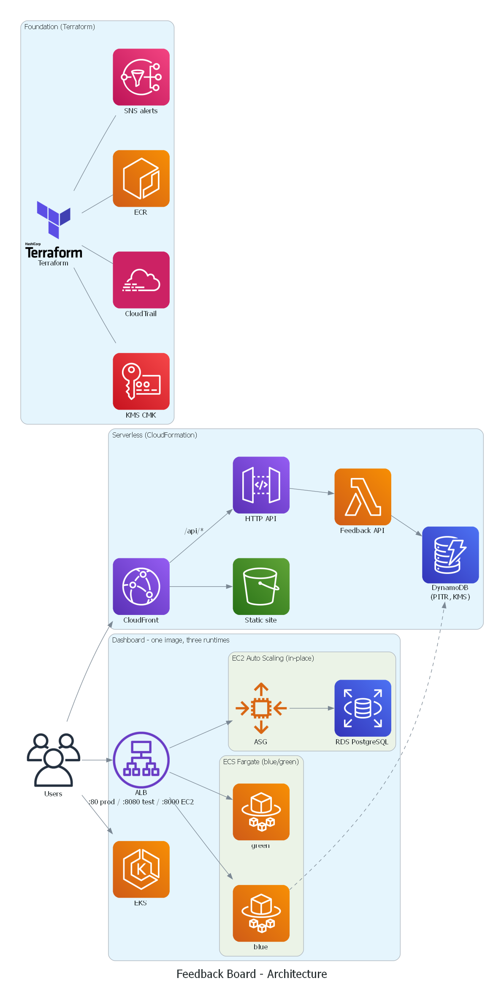

# Feedback Board: AWS DevOps Capstone

A small feedback app used to demonstrate a complete DevOps workflow on AWS: infrastructure as code,
CI/CD with quality and security gates, blue/green and in-place releases with automatic rollback,
containers on ECS and Kubernetes, centralized logging and alerting, and cost control.

Users submit feedback on a static page (CloudFront → S3). The page calls a serverless API
(API Gateway → Lambda → DynamoDB). A dashboard that summarizes the feedback runs as a container on
**ECS Fargate**, on an **EC2 Auto Scaling group** (with RDS) and on **EKS**. One codebase is
released three ways.



## What each part demonstrates

| Area | Implementation | Files |
|---|---|---|
| Infrastructure as Code | CloudFormation (5 stacks, parameters, outputs, cross-stack exports) and Terraform (shared foundation) | `infra/`, `terraform/` |
| CI/CD | CodePipeline: GitHub → CodeBuild → manual approval → CloudFormation + CodeDeploy + S3 | `infra/4-pipeline.yaml`, `buildspec.yml` |
| Quality gates | Unit tests (JUnit report in CodeBuild), handler self-check, `pip-audit` dependency CVE scan, ECR scan-on-push | `app/test_app.py`, `buildspec.yml` |
| Blue/green | CodeDeploy ECS blue/green, canary 10% for 5 min, prod + test listeners, health checks, alarm rollback | `infra/2-ecs.yaml`, `appspec.yaml` |
| Containers | Dockerfile, ECS task definition, Fargate service, target-tracking autoscaling | `app/Dockerfile`, `infra/2-ecs.yaml` |
| Kubernetes | EKS via eksctl, Deployment with probes, LoadBalancer Service, HPA, Pod Identity | `k8s/` |
| Jenkins integration | Jenkins on EC2: test, scan, `aws deploy push`, CodeDeploy in-place release | `Jenkinsfile`, `infra/5-ec2.yaml` |
| In-place deployment | CodeDeploy `OneAtATime` to an Auto Scaling group behind the ALB, auto-rollback | `ec2-deploy/`, `infra/5-ec2.yaml` |
| Serverless | API Gateway HTTP API, Lambda, DynamoDB (PITR), S3 + CloudFront (OAC) | `infra/1-serverless.yaml`, `lambda/` |
| Databases | DynamoDB (feedback), RDS PostgreSQL (visit counter, password in Secrets Manager) | `infra/1-serverless.yaml`, `infra/5-ec2.yaml` |
| Logging & monitoring | JSON logs from every tier, metric filters, error-pattern alarms → SNS, dashboard, Logs Insights queries, CloudWatch agent on EC2 | `infra/3-monitoring.yaml` |
| Auditing | CloudTrail trail (log file validation) to a KMS-encrypted bucket | `terraform/main.tf` |
| Security | Customer-managed KMS key (rotation on) for DynamoDB, logs, SNS, ECR, RDS, artifacts; least-privilege roles; IMDSv2; private RDS; Jenkins limited to admin IP | all |
| Patching | SSM Patch Manager association (`AWS-RunPatchBaseline`, weekly) | `infra/5-ec2.yaml` |
| Recovery | DynamoDB point-in-time recovery, RDS automated backups, automatic deployment rollback | see [Recovery runbook](#recovery-runbook) |
| Cost control | No NAT gateway, smallest Fargate/EC2 sizes, 7-day log retention, artifact expiry, phased deploy + teardown script | `scripts/` |

## Repository layout

```
app/            Flask dashboard (container image), tests, Dockerfile
lambda/         Feedback API Lambda handler
web/            Static page served by CloudFront
infra/          CloudFormation: 1-serverless, 2-ecs, 3-monitoring, 4-pipeline, 5-ec2
terraform/      Foundation: KMS key, CloudTrail, ECR, SNS topic, artifact bucket
ec2-deploy/     CodeDeploy in-place bundle (appspec + lifecycle hooks + systemd unit)
k8s/            eksctl cluster config and Kubernetes manifests
scripts/        deploy.sh / teardown.sh
docs/diagrams/  Architecture diagrams
buildspec.yml   CodeBuild steps          appspec.yaml  ECS blue/green appspec
Jenkinsfile     Jenkins pipeline for the EC2 track
```

## Prerequisites

- AWS account and AWS CLI v2 configured (default region `ap-south-1`)
- Terraform ≥ 1.6, Docker, Python 3.12+, bash (Git Bash on Windows)
- For the EKS phase: `eksctl` and `kubectl`
- A GitHub repository containing this code

## Setup

Deployment runs in three phases so each part can be shown and then removed to save cost.

### Phase 1: core (serverless, ECS, monitoring, pipeline)

```bash
ALERT_EMAIL=you@example.com GITHUB_REPO=<owner>/feedback-board scripts/deploy.sh core
```

This applies Terraform and then deploys the four CloudFormation stacks in order. Afterwards:

1. **Confirm the SNS subscription** from the email AWS sends you. Alarms and approval requests arrive there.
2. **Approve the GitHub connection:** Console → Developer Tools → Settings → Connections →
   `feedback-github-prod` → *Update pending connection*.
3. Start the first release with `aws codepipeline start-pipeline-execution --name feedback-board-prod`,
   or push a commit.

### Phase 2: EC2 track (Jenkins, Auto Scaling group, RDS)

```bash
scripts/deploy.sh ec2
```

Jenkins is then configured as code with `jenkins/configure.sh`, run on the server through SSM Run
Command (no SSH). It installs the plugins (checksum-verified plugin manager), creates the `admin` user,
skips the setup wizard, creates the `feedback-board-ec2` pipeline job from this repository's
`Jenkinsfile`, and queues the first build. The admin password is generated on the server
(`/var/lib/jenkins/admin-password`). Jenkins polls GitHub every 5 minutes for new commits.

### Phase 3: Kubernetes

```bash
scripts/deploy.sh eks      # ~15 min; prints the load balancer URL
```

## Usage

| What | Where |
|---|---|
| Submit and list feedback | `SiteUrl` output of `feedback-serverless-prod` (CloudFront) |
| API | `GET/POST <SiteUrl>/api/feedback`, body `{"message": "...", "rating": 1-5}` |
| Dashboard (ECS) | `DashboardUrl` output of `feedback-ecs-prod` |
| Dashboard, green version during a release | `TestListenerUrl` (port 8080) |
| Dashboard (EC2 + RDS visit counter) | `Ec2AppUrl` output of `feedback-ec2-prod` (port 8000) |
| Dashboard (EKS) | URL printed by `deploy.sh eks` |
| Monitoring | CloudWatch dashboard `feedback-board-prod` |

```bash
curl -s -X POST "$SITE/api/feedback" -H 'content-type: application/json' -d '{"message":"Great course","rating":5}'
curl -s "$SITE/api/feedback"
```

### Releasing a change

1. Push to `main`. CodePipeline runs tests, the vulnerability scan and the image build.
2. Approve the **ReleaseApproval** action (an email link arrives at the alert address).
3. CodeDeploy starts a green task set and sends 10% of production traffic to it for 5 minutes
   (watch it in CodeDeploy). If the 5xx or unhealthy-host alarm fires, it rolls back automatically.
   Otherwise all traffic moves to green and blue is terminated after 5 minutes.

### Manual release (without CodeBuild)

`scripts/release-ecs.sh <version> [app-dir]` runs the same steps as the pipeline: build and push the
image, register a new task definition revision, and start the CodeDeploy blue/green deployment.
It's for when CodeBuild is unavailable, for example a new account whose build concurrency quota
hasn't been raised yet.

### Rollback demo

Change `/health` in `app/app.py` to return status 500 and push. The green tasks never become
healthy, the deployment fails, and CodeDeploy rolls back to blue with no customer impact.
Revert the commit afterwards.

## Monitoring and logging

- Every tier writes one JSON object per log line (`level`, `msg`, `status`, `latency_ms`, …).
- Metric filters turn those lines into `FeedbackBoard/*` metrics: `ApiErrors`, `ApiValidationFailures`,
  `ApiLatencyMs`, `Gateway5xx`, `Dashboard5xx`, `DashboardExceptions` (text pattern `Traceback`).
- Alarms publish to the SNS topic: API errors, p90 latency, validation spike, dashboard exceptions,
  Lambda throttles, ALB 5xx and unhealthy hosts (the last two are also CodeDeploy rollback triggers).
- Saved Logs Insights queries: `feedback-prod/errors-all-tiers` and `feedback-prod/slowest-requests`.

## Environments

Every stack takes `EnvName` (`dev | staging | prod`) and uses it in resource names, so a second
environment is the same commands with `ENV_NAME=staging`.

## Recovery runbook

| Failure | Action |
|---|---|
| Bad release (ECS) | Automatic: CodeDeploy rolls back on alarm or failed health checks. Manual: *Stop and roll back* in CodeDeploy. If a rollback stops mid-canary with `ECS_UPDATE_ERROR … behind prod listener`, point the prod listener 100% at the original target group, then ship the fix as a new release (ECS refuses direct task-set changes on CodeDeploy-controlled services). |
| Bad release (EC2) | Automatic rollback on failed `ValidateService` hook or 5xx alarm. Manual: redeploy the previous revision in CodeDeploy. |
| Deleted or corrupted feedback | `aws dynamodb restore-table-to-point-in-time --source-table-name feedback-prod --target-table-name feedback-prod-restored --use-latest-restorable-time` |
| Database issue | RDS point-in-time restore from automated backups (1-day window) |
| Infrastructure drift | CloudFormation *Detect drift*, then redeploy the stack with `scripts/deploy.sh` |
| Audit "who changed what" | CloudTrail Event history, or the trail bucket (log file validation enabled) |

## Teardown

```bash
scripts/teardown.sh eks    # Kubernetes only
scripts/teardown.sh ec2    # Jenkins, Auto Scaling group, RDS
scripts/teardown.sh all    # everything, including Terraform
```

## Notes

- **CloudFront** is controlled by the `EnableCdn` parameter of the serverless stack. New AWS accounts must be
  verified by AWS Support before they can create distributions. Until then the stack deploys without it and
  the API is reachable at `ApiUrl`. After verification, set the default to `"true"` and push, and the pipeline adds it.
- **CodeCommit** is not used: it is closed to new AWS customers, and the brief specifies GitHub.
- The network uses the default VPC's public subnets with security-group isolation and no NAT gateway,
  to keep cost low. A production setup would put tasks, instances and RDS in private subnets.
- `CfnDeployRole` uses service-level permissions for the services in the serverless stack. A production
  setup would narrow these to resource ARNs.
